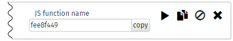
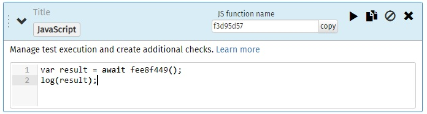

## Using JavaScript

JavaScript elements are a powerful tool to make your tests more flexible,
to meet all your requirements. You can call any elements of the test.
in any order from JavaScript and do additional checks on the results.
Asynchronous waiting for results, loops, conditional checks, and much more are available to you.

Any element of the test can be called from JavaScript using the name of the function, which is indicated in the header. This name can be changed in the interface.



We use a modern JavaScript engine using **async/await** structures so that the test runs synchronously
and you had a convenient linear follow up test run in the log.
Therefore, before calling functions for test items, you must use the **await** keyword.
If **await** is not specified, an exception will be thrown and the test will be interrupted.


``` JavaScript
var result = await fee8f449();
log(result);  
```
If you use your own functions inside which a call occurs with the keyword **await**,
before declaring them, you must specify the keyword **async**. You can read more about this technology [here] (https://javascript.info/async-await).
``` JavaScript
//need to specify async
async function myFunc(){
  return await fee8f449();
}
var result = await myFunc();

//optional async
function checkResult(r){
  if (r.response.statusCode != 200) throw "Status error";
}
checkResult(result);
```

You can set the "skip" flag on any element of the test so that it does not run during normal execution of the test, but you can call it from JavaScript.

## Built-in functions
Нестандартные встроенные функции

Function name | Description
------------ | -------------
console.log(arg1, arg2,...) or log(arg1, arg2,...) | The function displays a message in the log. The maximum text size is 50Kb.
variables.get(var_name)| Returns the value of a test variable by its name. Returns a value of type *string*.
variables.set(var_name, value)| Sets the new value of the test variable. The value is always cast to a string.
**await** pause(sec)| The pause in the test execution specified in seconds. The maximum single pause is 180 seconds. Asynchronous function, specify the await keyword before calling.

All variables declared using the **var** directive inside the JavaScript element are local. They will not be visible from other elements.
But you always have access to the global window object, which is saved between separate JavaScript calls.
You can assign and read its properties anywhere.

``` JavaScript
window.myValue = 1;
```
The value can be used in another element.
``` JavaScript
log(window.myValue);
// 1
```

**LastRequestResult** object contains the result of the last request.

### Request result

You can get an object with the result of the request, either directly in response to a call to the function of the request element or in the lastRequestResult object.
``` JavaScript
log(lastRequestResult);//last result
//or
log(await fee8f449());//call request item
```

Description of the properties of the request result object.

Propery | Type | Description
--------|---------|----------
**ok** | boolean | Is the result of request execution and all checks successful?
errorString | string | Error text
errorPack | object | Error object
errorPack.messageCode | string | Error code
errorPack.args | array of any | Error arguments
**request** | object | Request object
request.url | string | URL
request.path | string | The hostname of the URL executed
request.host | string | The path segment of the URL
request.method | string | Request method (GET, POST, PUT, etc.)
request.schema | string | http or https
request.params | \[index: string]: string &#124; string[] | Dictionary query URL parameters. The key is the name of the parameter. The dictionary value is a string or an array of strings.
request.form | \[index: string]: string | Dictionary of form parameters. The key is the name of the parameter. The dictionary value is a string.
request.headers | \[index: string]: string &#124; string[] | Dictionary http request headers. The key is the name of the parameter. The dictionary value is a string or an array of strings.
request.body | string | Raw request body
**response** | object | Response object
response.body | string | Response body
response.headers | \[index: string]: string | Dictionary http response headers. The key is the name of the parameter. The dictionary value is a string.
response.statusCode | number | Status code
response.statusMessage | string | Status message
response.size | number | Response body size
**response.timing** | object | Object response time
response.timing.dns | number | Time to get IP address from DNS
response.timing.firstByte | number | Time to receive the first byte of the response
response.timing.download | number | Response body time
response.timing.total | number | Total response time


### Available standard libraries and features.

- Math
- JSON
- Date
- RegExp
- parseInt
- parseFloat
- decodeURI
- decodeURIComponent
- encodeURI
- encodeURIComponent
- escape
- unescape

External libraries

Library | Description | Variable or function
------------|-------------|-------------
[Moment JS](https://momentjs.com/)|Parse, validate, manipulate, and display dates and times in JavaScript| moment()
[CryptoJS](https://github.com/brix/crypto-js)|JavaScript library of crypto standards| CryptoJS
[lodash](https://lodash.com/)|A modern JavaScript utility library delivering modularity, performance & extras.| _
[Chai Assertion Library](https://www.chaijs.com/)|BDD / TDD assertion library | assert

## Limitations

JavaScript execution is based on the V8 engine.
- Your code should not perform heavy calculations. If it does not respond for more than 3 seconds, then execution will be aborted with an error.
- The maximum size of a single line output to the log is 50Kb (*log()* function). Lines longer than this value will be trimmed.
- The maximum amount of memory available to you is approximately 50MB.
- Pauses during the test for more than 3 minutes will be counted for the execution of one request, according to your tarf plan. One request is debited from the account for every 3 minutes of a pause.
The pause counter is reset if any web request has been made between them.
- The maximum number of elements in the test is 1000.
- The maximum runtime of the entire test is 10 minutes.
- You cannot call more than one asynchronous function at the same time (via Promise.all () etc).

## Examples

Asynchronous wait for the result
``` JavaScript
var r = await pushJob();
variables.set("jobId", r.response.jsonBody.jobId);
do{
  var resStatus = await getStatus();
  var json = JSON.parse(resStatus.response.body);
  if (json.status == "error") throw "Job is failed";
} while (json.status != "complete")
log("Job is complete!");
```

Random parameters and request call loop.
``` JavaScript
for(var i = 0; i < 5; i++){
  var x = Math.floor(Math.random() * Math.floor(256));
  variables.set("x", x);
  var y = Math.floor(Math.random() * Math.floor(256));
  variables.set("y", y);
  await doRequest();//request uses "x" and "y" test variables
}
```
